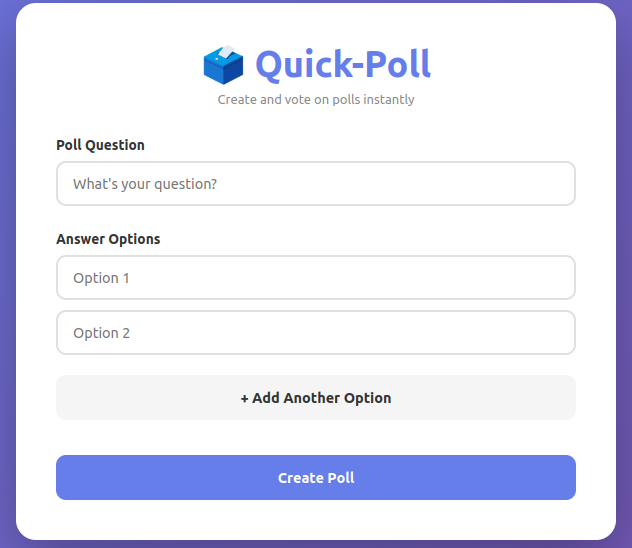
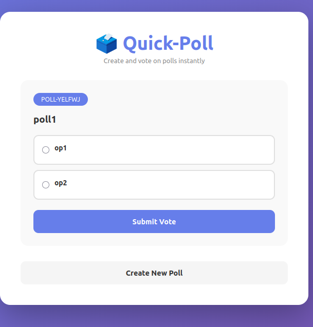

🗳️ Quick Poll

Quick Poll is a simple and interactive web application that allows users to create, vote on, and view poll results — all directly in the browser. Built with HTML, CSS, and JavaScript, it provides an elegant interface for quick feedback collection or fun opinion polls.

💡 Description

Quick Poll lets users create a poll question with multiple answer options. After submitting, users can immediately vote and see the results displayed as percentages.
All data is stored locally in the browser using localStorage, so no backend setup is required.

This makes it ideal for:

Classroom projects and software engineering labs

Small surveys or demos

Lightweight prototypes without a backend

⚙️ Features

✅ Create custom poll questions
✅ Add and remove answer options dynamically
✅ Vote and view live percentage results
✅ Prevent multiple votes per poll (locally)
✅ Responsive design (works on mobile and desktop)
✅ Fully client-side — no database or server required

🧱 Technologies Used

HTML5 — Structure and content

CSS3 — Styling, layout, and animations

JavaScript (Vanilla JS) — Application logic and state management

GitHub Pages — Hosting

⚠️ Limitations

Votes are not shared between users (local storage only)

Results reset when the browser data is cleared

No authentication or database support yet

🔮 Future Improvements

Connect to Firebase for real-time, shared results

Enable poll sharing via unique URLs

Add user authentication

Display results with charts

📸 Preview

